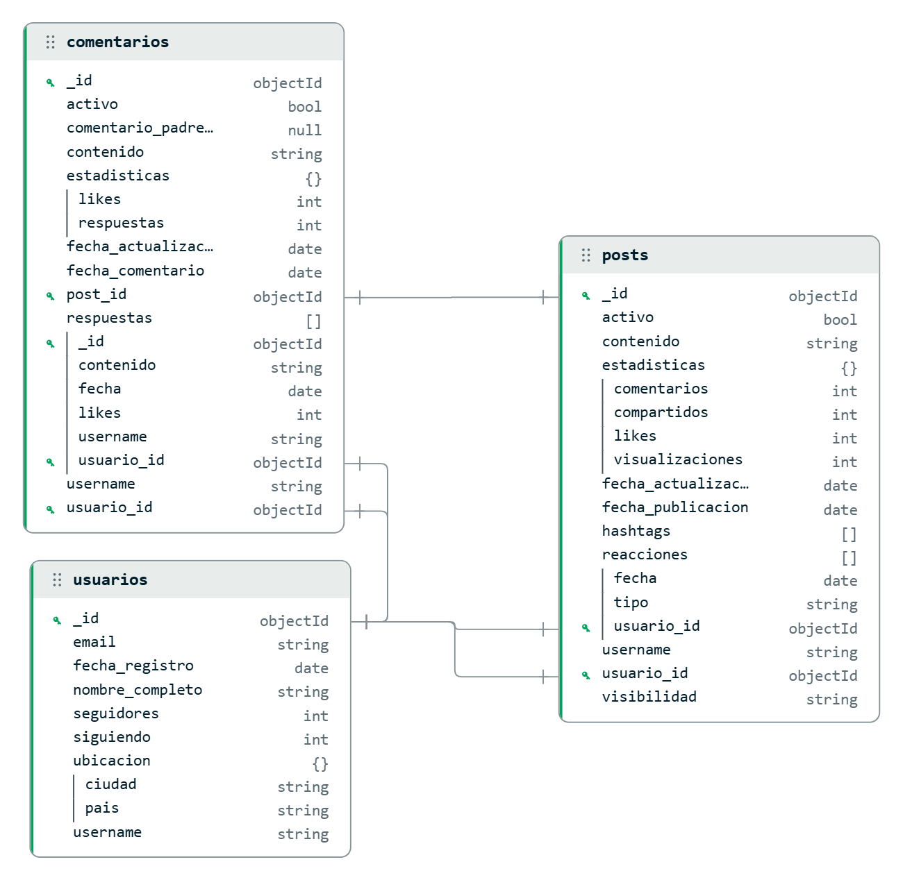

# Fase 2: MongoDB - Red Social

Este repositorio contiene la implementación de una base de datos MongoDB para gestionar datos de una red social, incluyendo usuarios, posts y comentarios. Este proyecto forma parte de la Tarea 4 sobre Almacenamiento y Consultas de Datos en BigData.

## 📋 Tabla de Contenidos

1. [Descripción del Proyecto](#descripción-del-proyecto)
2. [Requisitos Previos](#requisitos-previos)
3. [Instalación](#instalación)
4. [Diseño de la Base de Datos](#diseño-de-la-base-de-datos)
5. [Ejecución Paso a Paso](#ejecución-paso-a-paso)
6. [Estructura del Proyecto](#estructura-del-proyecto)
7. [Consultas Implementadas](#consultas-implementadas)
8. [Documentación Adicional](#documentación-adicional)

---

## 📝 Descripción del Proyecto

Este proyecto implementa una base de datos NoSQL utilizando MongoDB para almacenar y gestionar datos de una red social. El caso de uso seleccionado es ideal para MongoDB debido a:

- **Naturaleza semiestructurada de los datos**: Los datos de redes sociales pueden variar en estructura
- **Escalabilidad horizontal**: Necesidad de manejar grandes volúmenes de datos
- **Flexibilidad de esquema**: Permite agregar nuevos campos sin migraciones costosas
- **Consultas rápidas**: Optimizado para lectura de feeds y búsquedas

### Caso de Uso

**Almacenamiento de datos de redes sociales (posts, comentarios, usuarios)**

---

## 🔧 Requisitos Previos

Antes de comenzar, asegúrate de tener instalado:

- **Python 3.7 o superior**
- **MongoDB Community Server 8.2.1 o superior**
- **pip** (gestor de paquetes de Python)

---

## 💾 Instalación

### Paso 1: Instalar MongoDB

1. Descarga MongoDB Community Server desde el [sitio oficial de MongoDB](https://www.mongodb.com/try/download/community)
2. Ejecuta el instalador MSI para Windows
3. Durante la instalación, **no configures autenticación** (para este ejercicio se permite conexión local sin credenciales)
4. Verifica la instalación ejecutando en la terminal:

```bash
mongosh
```

O si usas una versión anterior:

```bash
mongo
```

### Paso 2: Instalar PyMongo

PyMongo es el driver oficial de Python para MongoDB. Instálalo usando pip:

```bash
pip install pymongo
```

### Paso 3: Verificar la Conexión

Asegúrate de que MongoDB esté ejecutándose. Por defecto, MongoDB se ejecuta en `localhost:27017`.

---

## 🗄️ Diseño de la Base de Datos

### Base de Datos: `red_social`

La base de datos está compuesta por tres colecciones principales:

```
┌─────────────────────────────────────────────────────────────────┐
│                    BASE DE DATOS: red_social                    │
└─────────────────────────────────────────────────────────────────┘
                              │
        ┌─────────────────────┼─────────────────────┐
        │                     │                     │
        ▼                     ▼                     ▼
┌──────────────┐    ┌──────────────┐    ┌──────────────┐
│   usuarios   │    │    posts     │    │  comentarios │
└──────────────┘    └──────────────┘    └──────────────┘
```

### Diagramas del Esquema

#### Figura 1: Esquema de la Base de Datos (MongoDB Compass)



*Figura 1. Esquema de la base de datos MongoDB para almacenamiento de datos de redes sociales (generado con MongoDB Compass)*

#### Figura 2: Diagrama del Esquema de Base de Datos


*Figura 2. Diagrama del esquema de base de datos para la red social*

### Colecciones

#### 1. **usuarios**
Almacena información de los usuarios de la red social.

**Campos principales:**
- `username` (String, único)
- `email` (String, único)
- `nombre_completo` (String)
- `fecha_registro` (Date)
- `seguidores` (Number)
- `siguiendo` (Number)
- `ubicacion` (Object: ciudad, pais)
- `activo` (Boolean)

#### 2. **posts**
Almacena las publicaciones de los usuarios.

**Campos principales:**
- `usuario_id` (ObjectId, referencia a usuarios)
- `username` (String, denormalizado)
- `contenido` (String)
- `fecha_publicacion` (Date)
- `estadisticas` (Object: likes, comentarios, compartidos, visualizaciones)
- `hashtags` (Array)
- `reacciones` (Array)
- `activo` (Boolean)

#### 3. **comentarios**
Almacena los comentarios de los posts.

**Campos principales:**
- `post_id` (ObjectId, referencia a posts)
- `usuario_id` (ObjectId, referencia a usuarios)
- `username` (String, denormalizado)
- `contenido` (String)
- `fecha_comentario` (Date)
- `estadisticas` (Object: likes, respuestas)
- `respuestas` (Array, comentarios anidados)
- `activo` (Boolean)

### Estrategia de Diseño

- **Denormalización selectiva**: Se almacena `username` en posts y comentarios para evitar joins frecuentes
- **Embebido vs Referencias**: Comentarios recientes y reacciones se almacenan embebidos en posts para acceso rápido
- **Índices**: Se crean índices en campos frecuentemente consultados para optimizar el rendimiento

Para más detalles sobre el esquema, consulta [ESQUEMA_REDES_SOCIALES.md](ESQUEMA_REDES_SOCIALES.md).

---

## 🚀 Ejecución Paso a Paso

### Paso 1: Crear la Base de Datos e Insertar Datos

Ejecuta el script `comandos_mongodb.py` para crear la base de datos, las colecciones y los datos de prueba:

```bash
python comandos_mongodb.py
```

**¿Qué hace este script?**

1. **Conecta a MongoDB**: Establece conexión con MongoDB en `localhost:27017`
2. **Crea/selecciona la base de datos**: Crea la base de datos `red_social`
3. **Inserta usuarios**: Crea 2 usuarios de prueba (Juan Pérez y María García)
4. **Inserta posts**: Crea 2 posts asociados a los usuarios
5. **Inserta comentarios**: Crea 2 comentarios con respuestas anidadas
6. **Crea índices**: Crea índices para optimizar las consultas
7. **Muestra resumen**: Imprime el total de documentos insertados

**Salida esperada:**

```
Usuarios insertados: 2
Posts insertados: 2
Comentarios insertados: 2
Índices creados exitosamente

=== RESUMEN DE DATOS INSERTADOS ===
Usuarios: 2
Posts: 2
Comentarios: 2
Total: 6 documentos

Conexión cerrada
```

### Paso 2: Ejecutar Consultas

Ejecuta el script `consultas_mongodb.py` para ver todas las consultas implementadas:

```bash
python consultas_mongodb.py
```

Este script ejecuta y muestra los resultados de:

1. **Consultas básicas CRUD** (Inserción, Selección, Actualización, Eliminación)
2. **Consultas con filtros y operadores** (Comparación, Lógicos, Arrays)
3. **Consultas de agregación** (Promedios, Sumas, Agrupaciones, Joins)

**Salida esperada:**

El script mostrará en consola todos los resultados de las consultas organizadas por categorías.

---

## 💻 Código Fuente

### Script: `comandos_mongodb.py`

Este script crea la base de datos, las colecciones e inserta los datos de prueba:

```python
# Script Python para crear base de datos MongoDB - Red Social
# Requiere: pip install pymongo

from pymongo import MongoClient
from datetime import datetime
from bson import ObjectId

# Conectar a MongoDB
client = MongoClient('mongodb://localhost:27017/')

# Crear/seleccionar base de datos
db = client['red_social']

# ============================================
# 1. COLECCIÓN: usuarios
# ============================================

usuarios = db['usuarios']

# Insertar 2 usuarios de prueba
usuarios_data = [
    {
        "username": "juan_perez",
        "email": "juan.perez@email.com",
        "nombre_completo": "Juan Pérez",
        "fecha_registro": datetime(2024, 1, 10, 10, 30, 0),
        "seguidores": 1250,
        "siguiendo": 450,
        "ubicacion": {
            "ciudad": "Bogotá",
            "pais": "Colombia"
        }
    },
    {
        "username": "maria_garcia",
        "email": "maria.garcia@email.com",
        "nombre_completo": "María García",
        "fecha_registro": datetime(2024, 2, 15, 14, 20, 0),
        "seguidores": 890,
        "siguiendo": 320,
        "ubicacion": {
            "ciudad": "Medellín",
            "pais": "Colombia"
        }
    }
]

resultado_usuarios = usuarios.insert_many(usuarios_data)
print(f"Usuarios insertados: {len(resultado_usuarios.inserted_ids)}")

# Obtener IDs de usuarios
juan = usuarios.find_one({"username": "juan_perez"})
maria = usuarios.find_one({"username": "maria_garcia"})

# ============================================
# 2. COLECCIÓN: posts
# ============================================

posts = db['posts']

# Insertar 2 posts de prueba
posts_data = [
    {
        "usuario_id": juan["_id"],
        "username": "juan_perez",
        "contenido": "Acabo de completar mi primera aplicación con MongoDB! 🎉 #programacion #mongodb #bigdata",
        "fecha_publicacion": datetime(2024, 12, 15, 14, 30, 0),
        "fecha_actualizacion": datetime(2024, 12, 15, 14, 30, 0),
        "visibilidad": "publico",
        "estadisticas": {
            "likes": 45,
            "comentarios": 12,
            "compartidos": 8,
            "visualizaciones": 320
        },
        "hashtags": ["programacion", "mongodb", "bigdata"],
        "reacciones": [
            {
                "usuario_id": maria["_id"],
                "tipo": "like",
                "fecha": datetime(2024, 12, 15, 14, 35, 0)
            }
        ],
        "activo": True
    },
    {
        "usuario_id": maria["_id"],
        "username": "maria_garcia",
        "contenido": "Compartiendo algunos tips de diseño UX para aplicaciones móviles 📱 #diseño #ux #mobile",
        "fecha_publicacion": datetime(2024, 12, 16, 9, 15, 0),
        "fecha_actualizacion": datetime(2024, 12, 16, 9, 15, 0),
        "visibilidad": "publico",
        "estadisticas": {
            "likes": 78,
            "comentarios": 15,
            "compartidos": 12,
            "visualizaciones": 450
        },
        "hashtags": ["diseño", "ux", "mobile"],
        "reacciones": [
            {
                "usuario_id": juan["_id"],
                "tipo": "like",
                "fecha": datetime(2024, 12, 16, 9, 20, 0)
            }
        ],
        "activo": True
    }
]

resultado_posts = posts.insert_many(posts_data)
print(f"Posts insertados: {len(resultado_posts.inserted_ids)}")

# Obtener IDs de posts
post1 = posts.find_one({"username": "juan_perez"})
post2 = posts.find_one({"username": "maria_garcia"})

# ============================================
# 3. COLECCIÓN: comentarios
# ============================================

comentarios = db['comentarios']

# Insertar 2 comentarios de prueba
comentarios_data = [
    {
        "post_id": post1["_id"],
        "usuario_id": maria["_id"],
        "username": "maria_garcia",
        "contenido": "Excelente trabajo! Me gustaría saber más sobre tu implementación.",
        "fecha_comentario": datetime(2024, 12, 15, 16, 0, 0),
        "fecha_actualizacion": datetime(2024, 12, 15, 16, 0, 0),
        "estadisticas": {
            "likes": 5,
            "respuestas": 2
        },
        "comentario_padre_id": None,
        "respuestas": [
            {
                "_id": ObjectId(),
                "usuario_id": juan["_id"],
                "username": "juan_perez",
                "contenido": "Gracias! Te puedo compartir el código si quieres",
                "fecha": datetime(2024, 12, 15, 16, 30, 0),
                "likes": 1
            }
        ],
        "activo": True
    },
    {
        "post_id": post2["_id"],
        "usuario_id": juan["_id"],
        "username": "juan_perez",
        "contenido": "Muy útiles estos tips! Los aplicaré en mi próximo proyecto.",
        "fecha_comentario": datetime(2024, 12, 16, 10, 0, 0),
        "fecha_actualizacion": datetime(2024, 12, 16, 10, 0, 0),
        "estadisticas": {
            "likes": 8,
            "respuestas": 0
        },
        "comentario_padre_id": None,
        "respuestas": [],
        "activo": True
    }
]

resultado_comentarios = comentarios.insert_many(comentarios_data)
print(f"Comentarios insertados: {len(resultado_comentarios.inserted_ids)}")

# ============================================
# 4. CREAR ÍNDICES
# ============================================

# Índices para usuarios
usuarios.create_index("username", unique=True)
usuarios.create_index("email", unique=True)
usuarios.create_index("fecha_registro")

# Índices para posts
posts.create_index("usuario_id")
posts.create_index([("fecha_publicacion", -1)])  # -1 = descendente
posts.create_index("hashtags")
posts.create_index("visibilidad")
posts.create_index([("estadisticas.likes", -1)])
posts.create_index([("contenido", "text"), ("hashtags", "text")])

# Índices para comentarios
comentarios.create_index("post_id")
comentarios.create_index("usuario_id")
comentarios.create_index([("fecha_comentario", -1)])
comentarios.create_index("comentario_padre_id")
comentarios.create_index([("estadisticas.likes", -1)])

print("Índices creados exitosamente")

# ============================================
# 5. VERIFICAR DATOS
# ============================================

print(f"\n=== RESUMEN DE DATOS INSERTADOS ===")
print(f"Usuarios: {usuarios.count_documents({})}")
print(f"Posts: {posts.count_documents({})}")
print(f"Comentarios: {comentarios.count_documents({})}")
print(f"Total: {usuarios.count_documents({}) + posts.count_documents({}) + comentarios.count_documents({})} documentos")

# Cerrar conexión
client.close()
print("\nConexión cerrada")
```

### Script: `consultas_mongodb.py`

Este script contiene todas las consultas implementadas. Para ver el código completo, consulta el archivo [consultas_mongodb.py](consultas_mongodb.py) en el repositorio.

**Ejemplo de consultas básicas:**

```python
from pymongo import MongoClient
from datetime import datetime

# Conectar a MongoDB
client = MongoClient('mongodb://localhost:27017/')
db = client['red_social']

usuarios = db['usuarios']
posts = db['posts']
comentarios = db['comentarios']

# ============================================
# CONSULTAS BASICAS (CRUD)
# ============================================

# INSERCIÓN
nuevo_usuario = {
    "username": "pedro_sanchez",
    "email": "pedro.sanchez@email.com",
    "nombre_completo": "Pedro Sánchez",
    "fecha_registro": datetime.now(),
    "seguidores": 500,
    "siguiendo": 200,
    "ubicacion": {"ciudad": "Cartagena", "pais": "Colombia"}
}
resultado = usuarios.insert_one(nuevo_usuario)

# SELECCIÓN
todos_usuarios = list(usuarios.find())
usuario = usuarios.find_one({"username": "juan_perez"})

# ACTUALIZACIÓN
usuarios.update_one(
    {"username": "juan_perez"},
    {"$set": {"seguidores": 1300}}
)

# ELIMINACIÓN (soft delete)
comentarios.update_one(
    {"username": "juan_perez", "activo": True},
    {"$set": {"activo": False}}
)

# ============================================
# CONSULTAS CON FILTROS Y OPERADORES
# ============================================

# Operadores de comparación
usuarios.find({"seguidores": {"$gt": 1000}})
posts.find({"estadisticas.likes": {"$lt": 50}})

# Operadores lógicos
posts.find({
    "$and": [
        {"estadisticas.likes": {"$gt": 40}},
        {"estadisticas.comentarios": {"$gt": 10}}
    ]
})

# Operadores de array
posts.find({"hashtags": "mongodb"})
posts.find({"hashtags": {"$in": ["programacion", "diseño"]}})

# ============================================
# CONSULTAS DE AGREGACIÓN
# ============================================

# Promedio de seguidores
pipeline = [
    {
        "$group": {
            "_id": None,
            "promedio_seguidores": {"$avg": "$seguidores"},
            "total_usuarios": {"$sum": 1}
        }
    }
]
resultado = list(usuarios.aggregate(pipeline))

# Agrupar posts por usuario
pipeline = [
    {
        "$group": {
            "_id": "$username",
            "total_posts": {"$sum": 1},
            "total_likes": {"$sum": "$estadisticas.likes"},
            "promedio_likes": {"$avg": "$estadisticas.likes"}
        }
    },
    {"$sort": {"total_likes": -1}}
]
resultado = list(posts.aggregate(pipeline))

# Contar hashtags
pipeline = [
    {"$unwind": "$hashtags"},
    {
        "$group": {
            "_id": "$hashtags",
            "total_apariciones": {"$sum": 1}
        }
    },
    {"$sort": {"total_apariciones": -1}}
]
resultado = list(posts.aggregate(pipeline))

# Join entre colecciones
pipeline = [
    {
        "$lookup": {
            "from": "usuarios",
            "localField": "usuario_id",
            "foreignField": "_id",
            "as": "usuario_info"
        }
    },
    {"$unwind": "$usuario_info"},
    {
        "$project": {
            "username": 1,
            "contenido": 1,
            "likes": "$estadisticas.likes",
            "ciudad_usuario": "$usuario_info.ubicacion.ciudad",
            "seguidores_usuario": "$usuario_info.seguidores"
        }
    }
]
resultado = list(posts.aggregate(pipeline))

client.close()
```

---

## 📁 Estructura del Proyecto

```
fase2-mongodb/
│
├── README.md                           # Este archivo
├── ESQUEMA_REDES_SOCIALES.md           # Documentación detallada del esquema
├── comandos_mongodb.py                 # Script para crear BD e insertar datos
├── consultas_mongodb.py                # Script con todas las consultas
├── requirements.txt                    # Dependencias Python
├── red_social.png                      # Esquema de BD (MongoDB Compass)
└── esquema_base_datos_red_social.png   # Diagrama del esquema
```

---

## 🔍 Consultas Implementadas

### 4.2.2 Consultas Básicas (CRUD)

#### Inserción
```python
nuevo_usuario = {
    "username": "pedro_sanchez",
    "email": "pedro.sanchez@email.com",
    "nombre_completo": "Pedro Sánchez",
    "fecha_registro": datetime.now(),
    "seguidores": 500,
    "siguiendo": 200,
    "ubicacion": {"ciudad": "Cartagena", "pais": "Colombia"}
}
resultado = usuarios.insert_one(nuevo_usuario)
```

#### Selección
```python
# Todos los usuarios
todos_usuarios = list(usuarios.find())

# Usuario específico
usuario = usuarios.find_one({"username": "juan_perez"})

# Con proyección (solo campos específicos)
usuarios = list(usuarios.find({}, {"username": 1, "email": 1, "seguidores": 1}))
```

#### Actualización
```python
# Actualizar un campo
usuarios.update_one(
    {"username": "juan_perez"},
    {"$set": {"seguidores": 1300}}
)

# Incrementar un valor
posts.update_one(
    {"username": "maria_garcia"},
    {"$inc": {"estadisticas.likes": 5}}
)
```

#### Eliminación
```python
# Soft delete (marcar como inactivo)
comentarios.update_one(
    {"username": "juan_perez", "activo": True},
    {"$set": {"activo": False}}
)
```

### 4.2.3 Consultas con Filtros y Operadores

#### Operadores de Comparación
```python
# Mayor que
usuarios.find({"seguidores": {"$gt": 1000}})

# Menor que
posts.find({"estadisticas.likes": {"$lt": 50}})

# Rango
usuarios.find({"seguidores": {"$gte": 800, "$lte": 1500}})

# Diferente
posts.find({"username": {"$ne": "juan_perez"}})
```

#### Operadores Lógicos
```python
# AND
posts.find({
    "$and": [
        {"estadisticas.likes": {"$gt": 40}},
        {"estadisticas.comentarios": {"$gt": 10}}
    ]
})

# OR
usuarios.find({
    "$or": [
        {"ubicacion.ciudad": "Bogotá"},
        {"ubicacion.ciudad": "Medellín"}
    ]
})
```

#### Operadores de Array
```python
# Buscar en array
posts.find({"hashtags": "mongodb"})

# Contiene cualquiera de los valores
posts.find({"hashtags": {"$in": ["programacion", "diseño"]}})

# Debe contener todos los valores
posts.find({"hashtags": {"$all": ["mongodb", "bigdata"]}})
```

### 4.2.4 Consultas de Agregación

#### Promedio
```python
pipeline = [
    {
        "$group": {
            "_id": None,
            "promedio_seguidores": {"$avg": "$seguidores"},
            "total_usuarios": {"$sum": 1}
        }
    }
]
resultado = list(usuarios.aggregate(pipeline))
```

#### Suma
```python
pipeline = [
    {
        "$group": {
            "_id": None,
            "total_likes": {"$sum": "$estadisticas.likes"},
            "total_comentarios": {"$sum": "$estadisticas.comentarios"}
        }
    }
]
resultado = list(posts.aggregate(pipeline))
```

#### Agrupación
```python
pipeline = [
    {
        "$group": {
            "_id": "$username",
            "total_posts": {"$sum": 1},
            "total_likes": {"$sum": "$estadisticas.likes"},
            "promedio_likes": {"$avg": "$estadisticas.likes"}
        }
    },
    {"$sort": {"total_likes": -1}}
]
resultado = list(posts.aggregate(pipeline))
```

#### Unwind (Descomponer Arrays)
```python
pipeline = [
    {"$unwind": "$hashtags"},
    {
        "$group": {
            "_id": "$hashtags",
            "total_apariciones": {"$sum": 1}
        }
    },
    {"$sort": {"total_apariciones": -1}}
]
resultado = list(posts.aggregate(pipeline))
```

#### Lookup (Join entre colecciones)
```python
pipeline = [
    {
        "$lookup": {
            "from": "usuarios",
            "localField": "usuario_id",
            "foreignField": "_id",
            "as": "usuario_info"
        }
    },
    {"$unwind": "$usuario_info"},
    {
        "$project": {
            "username": 1,
            "contenido": 1,
            "likes": "$estadisticas.likes",
            "ciudad_usuario": "$usuario_info.ubicacion.ciudad",
            "seguidores_usuario": "$usuario_info.seguidores"
        }
    }
]
resultado = list(posts.aggregate(pipeline))
```

---

## 📚 Documentación Adicional

Para más información sobre:

- **Esquema detallado**: Consulta [ESQUEMA_REDES_SOCIALES.md](ESQUEMA_REDES_SOCIALES.md)
- **Código de consultas**: Revisa el archivo `consultas_mongodb.py` con comentarios explicativos
- **Script de creación**: Revisa el archivo `comandos_mongodb.py` para entender la estructura de datos

---

## 🔐 Notas de Seguridad

⚠️ **Importante**: Para este ejercicio educativo, MongoDB se configuró **sin autenticación** para facilitar el desarrollo y las pruebas. En un entorno de producción, siempre se debe configurar autenticación con usuario y contraseña.

Para configurar autenticación en MongoDB:

1. Crear un usuario administrador
2. Habilitar autenticación en el archivo de configuración
3. Modificar la cadena de conexión en los scripts para incluir credenciales

---

## 👤 Autor

**CRISTIAN JOHAN GALVIS BERNAL**

**Curso**: BigData - Universidad Nacional Abierta y a Distancia (UNAD)  
**Año**: 2025

---

## 📄 Licencia

Este proyecto es parte de una tarea académica y se proporciona únicamente con fines educativos.

---

## 🔗 Enlaces Útiles

- [Documentación oficial de MongoDB](https://www.mongodb.com/docs/)
- [PyMongo Documentation](https://pymongo.readthedocs.io/)
- [MongoDB University](https://university.mongodb.com/)
- [MongoDB Compass](https://www.mongodb.com/products/compass)

---

## 📝 Notas Finales

- Los scripts están comentados para facilitar la comprensión
- Se recomienda ejecutar primero `comandos_mongodb.py` y luego `consultas_mongodb.py`
- Para empezar desde cero, descomenta las líneas de limpieza en `comandos_mongodb.py`
- Los datos de prueba pueden expandirse para cumplir con el requisito de 100+ documentos

